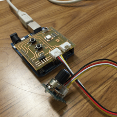

# Smart Blinker #

*Demo application for my lecture on Arduino Day 2015 at @plzenskybarcamp.*

Demo utilized Arduino with RBG LED and 2 buttons.

Arduino can "learn" sequence you press on button A and then repeate it all over again. Button B is for enter to learning mode.
